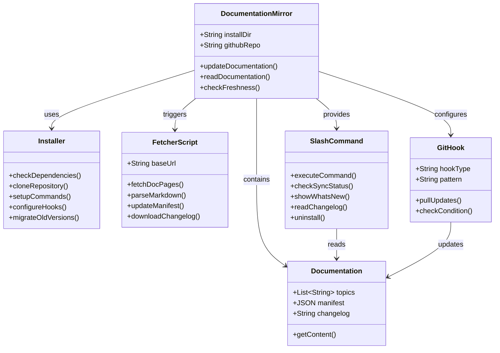
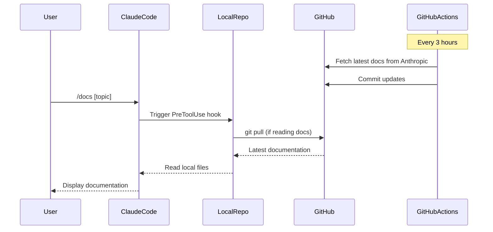

# Claude Code Documentation Mirror - Project Overview

## Architecture Diagram (ASCII)

```
┌─────────────────────────────────────────────────────────────────────┐
│                    Claude Code Documentation Mirror                  │
│                                                                       │
│  ┌───────────────┐      ┌──────────────┐      ┌─────────────────┐  │
│  │   GitHub      │      │   Local      │      │  Claude Code    │  │
│  │   Actions     │──────│  Repository  │──────│  Integration    │  │
│  │  (Auto-sync)  │      │ ~/.claude-   │      │   (/docs cmd)   │  │
│  │               │      │  code-docs   │      │                 │  │
│  └───────┬───────┘      └──────┬───────┘      └────────┬────────┘  │
│          │                     │                        │           │
│          ▼                     ▼                        ▼           │
│  ┌───────────────────────────────────────────────────────────────┐  │
│  │                     Main Components                           │  │
│  ├─────────────────┬─────────────────┬──────────────────────────┤  │
│  │  Fetcher        │  Installer      │  Command Handler         │  │
│  │  - Python       │  - Bash script  │  - Slash command         │  │
│  │  - Web scraper  │  - Migration    │  - Git hooks             │  │
│  │  - 3hr updates  │  - Setup hooks  │  - Local reader          │  │
│  └─────────────────┴─────────────────┴──────────────────────────┘  │
│                                                                       │
│  ┌───────────────────────────────────────────────────────────────┐  │
│  │                     Documentation Files                       │  │
│  │  ┌──────────┐ ┌──────────┐ ┌──────────┐ ┌──────────────────┐│  │
│  │  │ hooks.md │ │  mcp.md  │ │memory.md │ │ 40+ other docs   ││  │
│  │  └──────────┘ └──────────┘ └──────────┘ └──────────────────┘│  │
│  └───────────────────────────────────────────────────────────────┘  │
└─────────────────────────────────────────────────────────────────────┘
```

## System Flow (Mermaid)

```mermaid
graph TB
    subgraph "Anthropic Docs Website"
        A[docs.anthropic.com/claude-code]
    end
    
    subgraph "GitHub Repository"
        B[GitHub Actions<br/>Scheduled Every 3hrs]
        C[Python Fetcher Script]
        D[Documentation Storage]
        B -->|Triggers| C
        C -->|Updates| D
    end
    
    subgraph "User's Local System"
        E[Install Script<br/>install.sh]
        F[~/.claude-code-docs<br/>Local Mirror]
        G[Claude Code Settings<br/>~/.claude/settings.json]
        H[/docs Command<br/>~/.claude/commands/docs.md]
        I[PreToolUse Hook<br/>Auto-update on read]
    end
    
    subgraph "Claude Code Integration"
        J[User Types /docs]
        K[Command Execution]
        L[Read Local Docs]
        M[Display in Claude]
    end
    
    A -->|Fetch via HTTP| C
    D -->|Git Pull| F
    E -->|Clones Repo| F
    E -->|Creates| H
    E -->|Modifies| G
    G -->|Configures| I
    I -->|Git Pull on Read| F
    J --> K
    K --> L
    L -->|Access| F
    L --> M
```

## Component Architecture (Mermaid)



## Update Sequence (Mermaid)



## Installation

### Prerequisites
- Git (version control)
- jq (JSON processor)
- curl (data transfer)
- Claude Code

### Installation Command
Run from any directory:
```bash
curl -fsSL https://raw.githubusercontent.com/ericbuess/claude-code-docs/main/install.sh | bash
```

### Installation Process
1. Creates `~/.claude-code-docs` directory
2. Clones documentation repository
3. Creates `/docs` command in `~/.claude/commands/docs.md`
4. Configures auto-update hook in `~/.claude/settings.json`
5. Migrates existing installations if present

### Directory Structure
```
~/
├── .claude-code-docs/
│   ├── docs/
│   │   ├── hooks.md
│   │   ├── mcp.md
│   │   ├── memory.md
│   │   └── ... (40+ docs)
│   ├── scripts/
│   ├── install.sh
│   └── uninstall.sh
└── .claude/
    ├── commands/
    │   └── docs.md
    └── settings.json
```

## Usage
- `/docs [topic]` - Read documentation instantly
- `/docs -t` - Check sync status with GitHub
- `/docs changelog` - View Claude Code release notes
- `/docs what's new` - Show recent documentation changes
- `/docs uninstall` - Remove installation

## Project Summary

Local caching and synchronization system for Claude Code documentation that:
1. Mirrors official documentation from Anthropic
2. Auto-updates every 3 hours via GitHub Actions
3. Provides instant local access through /docs command
4. Maintains freshness with git hooks
5. Tracks changelog and documentation changes
6. Supports macOS and Linux platforms